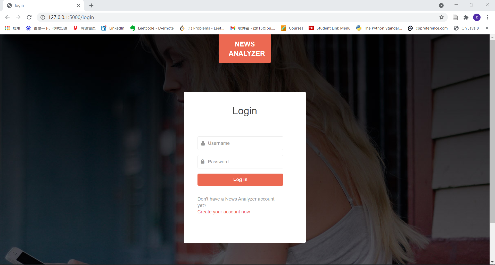
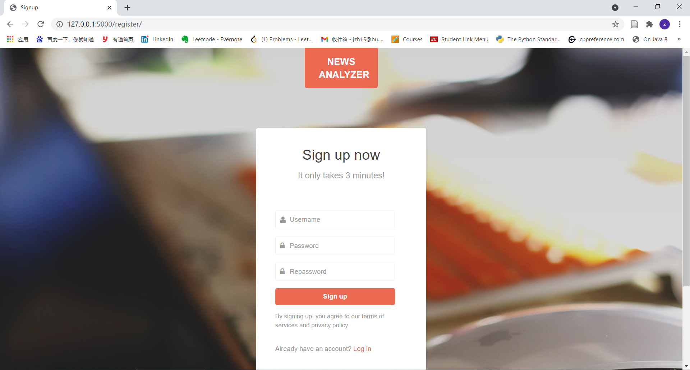
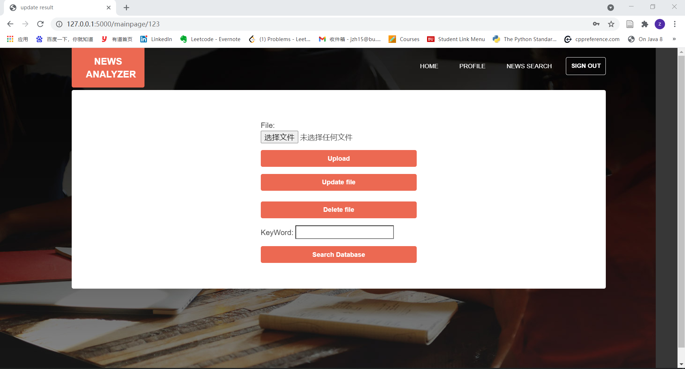
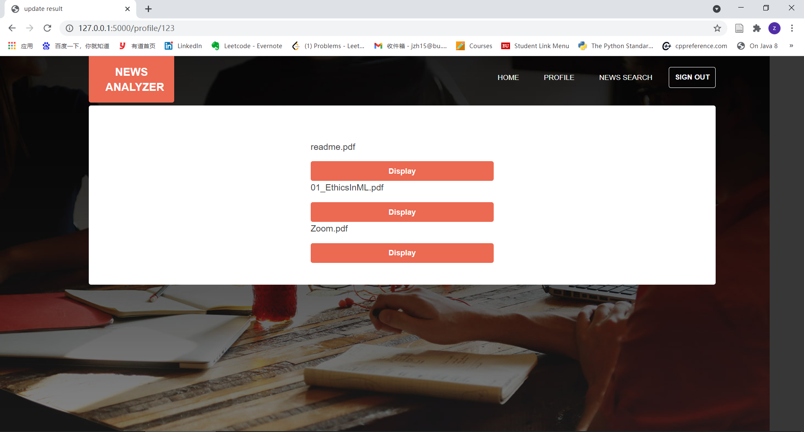
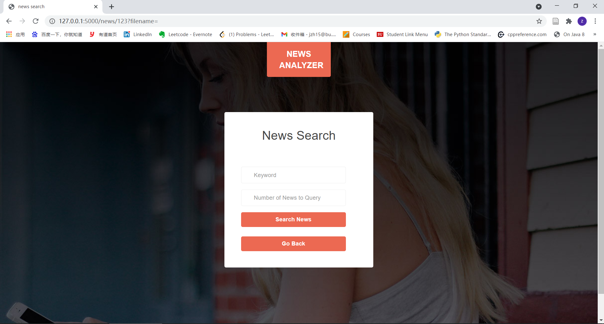

# News_Analyzer_app

The introduction video can be found [here](./presentation.mp4)
Functions we have improved:

1. search all the files and show keyword in different paragraphs with sentiment analysis (count the total number)

2. signup,login, authentication

3. make the web nice looking

4.display all uploaded files user has uploaded. 

5. security logout

## User Story

I, the investigator, need to login to a secure service to upload my content

I, the investigator, have a number of PDF files that I want to upload to my account.

I, the investigator, want to search in all files I have uploaded.

I, the investigator, want to discover content from the WEB to enhance story

I, the investigator, want to know find the common keywords in subset of my documents.

I, the investigator, want to know all names, locations, institutions and address in my 
documents.

I, the investigator, want to know any relation between names, locations and institutions.

I, the investigator, want to find relationship between keywords in the ingested and discovered 
content.

I, the investigator, want to find sentiment (positive, negative or neutral) of different parts of the content

I, the investigator, want to modify the sentiment calculated by the system in case I disagree.

I, the investigator, want to search based on keywords and sentiments

I, the investigator, want the system to calculate similarities or correlation between key wor 

Provide snapshots and summary of documents

I, the investigator, want to upload different types of files (CSV, DOC, etc.)

## Website Structure
### Mainpage

  

this page roughly introduce the function of news analyzer

click the login button on top of the website to login

click the sign up button or the 'Try News Analyzer Free' button to sign up

### Login page

  

this page is login page, where user can type their information to login

if user entered wrong information or did not sign up, we will remind them to enter correct information or regist

click the 'Create your account now' redirect user to regist page

click the 'NEWS ANALYZER' logo will redirect user to mainpage

### Register page

  

this page allows users to create their account

if password equals to repassword, account will be created and saved in database, else it will remind user to enter correct information

if user already has an account, they can click 'Login' to login

click the 'NEWS ANALYZER' logo will redirect user to mainpage

### Account Homepage

  

this page contains the main functions of our website

click 'Upload' user can upload files and files will be saved in databse

click 'Update' button, user can input filename and update the file 

click 'Delete' button, user can delete files from the database

by inputting keyword, our app will search for files containing the keyword and display them
all keywords in each paragrah of files will be marked red
the emotion of each file containing the keyword will also be displayed

### Account Profile

  

this button on the top of screen leads user to Profile page, where user can check all the files they have uploaded to the database

click the 'NEWS ANALYZER' logo will redirect user to Account Homepage

click 'Home' will redirect user to Account Homepage

click 'News Search' will redirect user to News Search page
### News Search

  

this page catch latest news from websites like New York Times and user can search news from these website by keyword 
